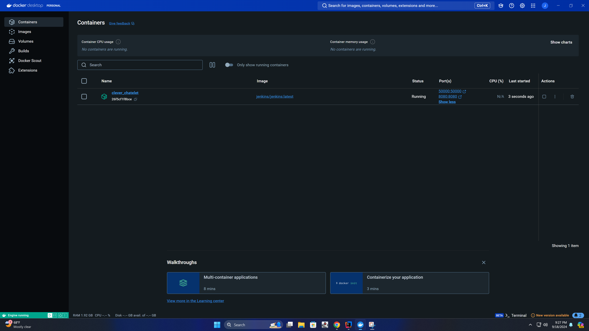

# Software Testing with JUnit

Hello! This is a project completed for my CS-320: Software Testing class. It covers the fundamental concepts of software testing using JUnit and Maven for dependency management and build automation. The project also includes test coverage analysis and showcases integration with Jenkins for Continuous Integration/Continuous Deployment (CI/CD).
## How to run on your machine

Run this command:

```bash
git clone https://github.com/JPplayground/TestingWithJunit.git
```

Then open in your favorite IDE! To run the test utilize you IDE tools or you can directly run:

```bash
mvn clean test
```

## Jenkins Integration

For this project I also utilized Jenkins to get some practice with Jenkins. On the chance that you are trying to replicate this process,
install Docker and run Jenkins from there.  With the proper setup you can access Jenkins on localhost:8080 and construct a build process.

Running Docker Container:

Jenkins Build Output:

Jenkins Test Report:
